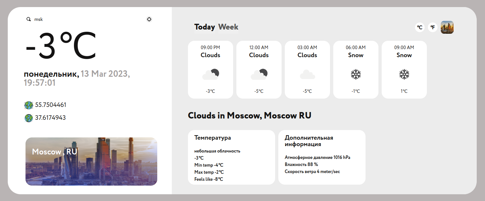

<p align="center">
  <a href="" rel="noopener">
 </a>
</p>


<div align="center">
<h3 align="center">Weather widget</h3>


[]()
[](https://github.com/kylelobo/The-Documentation-Compendium/pulls)
[](/LICENSE)

</div>

---

<p align="center"> Фронтенд-часть виджета прогноза погоды
    <br> 
</p>


# Weather widget TS


## Table of Contents

- [Check result](https://weather.siestacloud.ru/)
- [About](#about)
- [Getting Started](#getting_started)
## 😉 Check result <a name = "Check result"></a>
Итоговая реализация проекта доступна по ссылке <https://weather.siestacloud.ru/>
## 🧐 About <a name = "about"></a>

Проект выполнен в рамках технического задания модуля React

## 🔧 Getting Started <a name = "getting_started"></a>

Эти инструкции помогут вам создать копию проекта в локальном окружении для разработки и тестирования. 

###  Installing
```
git clone  https://gitlab.com/infrastructures/panorama/workflow-k8s/client-workflow/weather/-/tree/main

npm i
npm run build
npm run start
```
Перед запуском или сборкой проекта в корне необходимо создать файл ./src/.env.local, и заполнить его следующим образом:

```
REACT_APP_API_KEY=<Ваш API-ключ от openweathermap>
```

---


### расшифровка CICD secrets 


```
cat .helm/values-prod-encrypted.yaml | werf helm secret decrypt -o .helm/values-prod-decrypted.yaml
cat .helm/values-prod-decrypted.yaml | werf helm secret encrypt -o .helm/values-prod-encrypted.yaml
```


